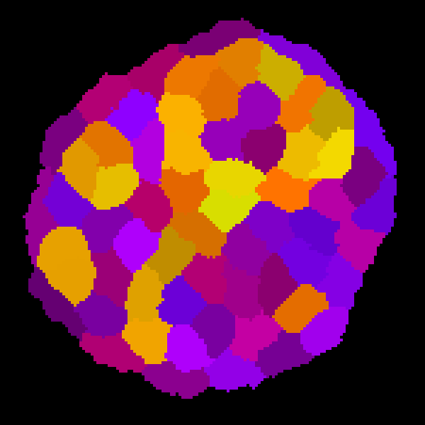

Cellular Potts Model implementation, designed around a blastocyst simulation. Designed to be rapidly configurable. The current build is mostly stable, and should be compatible with all noteworthy operating systems.

# Requires

SDL2 (Preferably 2.0.14 or higher)

SDL2_image

Cmake

# How to run

To run the default blastocyst simulation, execute as is.
To run a custom simulation, use the name of the config file as the command line argument. There should be a matching pgm file to use as the initial condition.

# Documentation
Check the wiki for documentation on how to set up a custom simulation.
